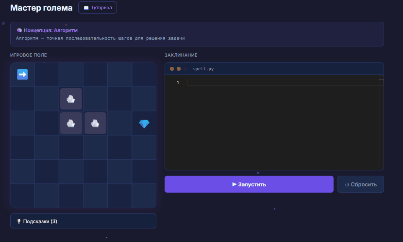

# Code & Spell

[](https://github.com/SspablosS/code-and-spell/actions/workflows/ci.yml)


Обучающая веб-игра, которая учит основам программирования через магический сеттинг: игрок пишет код в редакторе, а персонаж на канвасе выполняет команды в реальном времени.



## Возможности

- Написание кода прямо в браузере через **Monaco Editor** (тот же движок, что в VS Code)
- Пошаговая интерпретация написанного кода с визуализацией на 2D-канвасе (**React Konva**)
- Поддержка циклов (`repeat`), условий и базовых игровых команд
- Авторизация через JWT (httpOnly cookie)
- Полностью контейнеризовано — поднимается одной командой через Docker Compose

## Быстрый старт (Docker)

```bash
cp .env.example .env  # заполните переменные окружения
cd docker
docker-compose up --build
```

Приложение будет доступно на http://localhost

## Разработка без Docker

### Backend

```bash
cd server
npm install
npx prisma migrate dev
npm run dev
```

### Frontend

```bash
cd client
npm install
npm run dev
```

### Одновременный запуск (из корня)

```bash
npm install
npm run dev
```

## Запуск тестов

```bash
cd server
npm test

cd client
npm test
```

Или из корня:

```bash
npm test
```

## Архитектурные решения MVP

- **Auth**: один JWT в httpOnly cookie (refresh token — P1)
- **Циклы**: один уровень вложенности `repeat` (вложенные — P1)
- **Анимация**: пошаговая через `setTimeout` (плавная — P1)
- **E2E тесты**: не реализованы (Playwright — P1)

## Стек

### Frontend

- React 18
- Vite
- TypeScript
- TailwindCSS
- Zustand (state management)
- React Konva (game canvas)
- Monaco Editor (code editor)
- Vitest (testing)
- Sentry (error tracking)

### Backend

- Node.js 20
- Express
- TypeScript
- Prisma (ORM)
- PostgreSQL
- JWT (authentication)
- bcryptjs (password hashing)
- Jest (testing)
- Winston (logging)
- Sentry (error tracking)

## Структура проекта

```
code-and-spell/
├── client/                 # Frontend (React + Vite)
│   ├── src/
│   │   ├── components/    # React компоненты
│   │   ├── hooks/         # Custom hooks
│   │   ├── interpreter/   # Game interpreter
│   │   ├── pages/         # Page components
│   │   ├── services/      # API services
│   │   ├── store/         # Zustand store
│   │   └── types/         # TypeScript types
│   ├── Dockerfile
│   ├── nginx.conf
│   └── package.json
├── server/                # Backend (Express + Prisma)
│   ├── src/
│   │   ├── config/        # Configuration
│   │   ├── controllers/   # Route controllers
│   │   ├── middleware/    # Express middleware
│   │   ├── routes/        # API routes
│   │   ├── services/      # Business logic
│   │   └── __tests__/     # Tests
│   ├── prisma/
│   │   ├── migrations/    # Database migrations
│   │   ├── schema.prisma  # Prisma schema
│   │   └── seed.ts       # Database seed
│   ├── Dockerfile
│   └── package.json
├── docker/                # Docker Compose
│   ├── docker-compose.yml
│   └── postgres/
│       └── init.sql
├── database/
│   └── seeds/
│       └── levels.json    # Level data
├── docs/
│   └── demo.gif           # Демо приложения (см. README выше)
├── .github/
│   └── workflows/
│       └── ci.yml        # GitHub Actions CI
└── package.json           # Root package.json (monorepo)
```

## Roadmap (P1)

- [ ] Refresh token для авторизации
- [ ] Вложенные циклы в интерпретаторе
- [ ] Плавная анимация вместо пошаговой
- [ ] E2E тесты на Playwright
